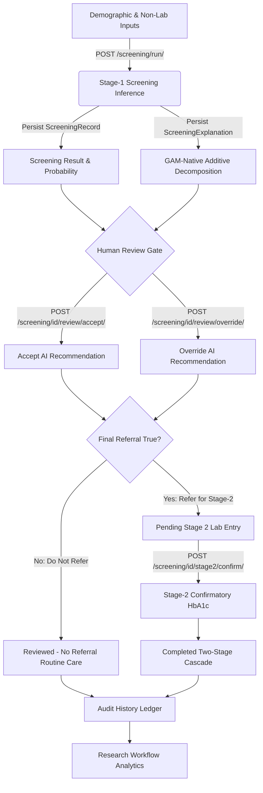
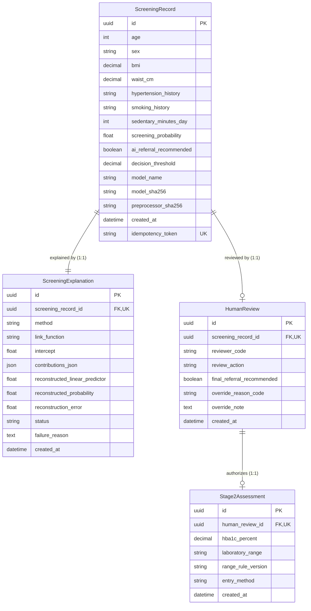
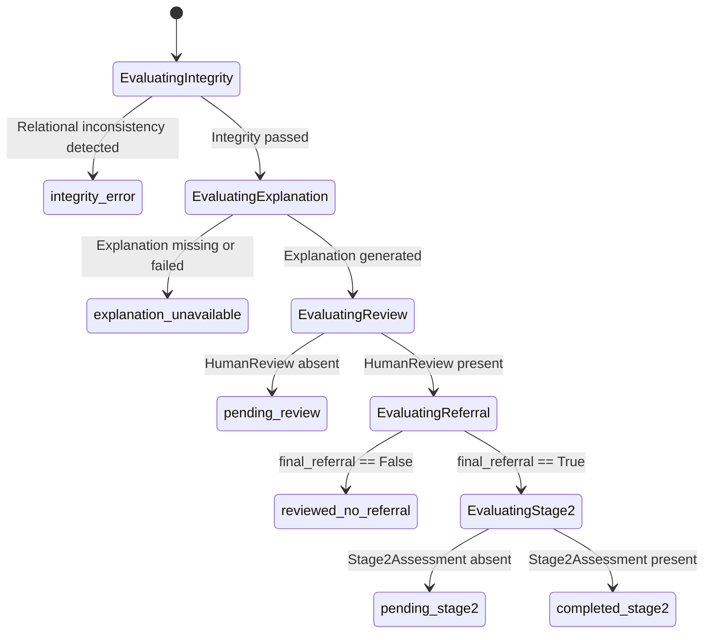

# DASHBOARD MASTER CONTEXT HANDOFF: READ-ONLY FORENSIC AUDIT & ARCHITECTURE MANUAL
## Complete Technical, Methodological, and Governance Documentation for `research-prototype-v1.0`

**Document Status:** Complete & Authoritative  
**Release Identifier:** `research-prototype-v1.0` (Frozen 2026-09-05)  
**Target Audience:** Felik (Thesis Student), Academic Supervisors, Thesis Defense Examiners, and Successor AI Coding Agents  
**Purpose:** Account Migration, Methodology Reconstruction, Code Architecture Mastery, and Thesis Defense Preparation  
**Precedence Hierarchy:**
1. Frozen Application Code (`dashboard/predictor/`)
2. D3 System Audit & Release Freeze Documentation (`design/d3/`)
3. Active D2 Implementation Contracts (`design/d2_1/` through `design/d2_10/`)
4. E1 Evaluation Protocol Specification (`evaluation/e1/` v1.0.3)
5. Historical Phase D1 / Initial Prototypes (Marked strictly as `HISTORICAL / SUPERSEDED`)

---

## 1. Executive System Summary

### 1.1 What is this Dashboard?
The Dysglycemia Screening Dashboard (`research-prototype-v1.0`) is an academic **two-stage clinical decision-support research prototype** built to investigate Human–AI decision-making interactions during non-laboratory community dysglycemia screening. It implements an **Evidence-First Guided Review** workflow that couples an immutable Generalized Additive Model (GAM) with additive feature attribution, structured human clinician review/override capabilities, and a confirmatory laboratory intake stage.

- **Repository Source:** `dashboard/predictor/`
- **Application Shell Entrypoint:** `dashboard/predictor/views.py` (`overview_view`, lines 51–96)
- **Primary Layout:** `dashboard/predictor/templates/predictor/base.html`

### 1.2 Clinical & Operational Problem Supported
In resource-constrained, decentralized, or community health screening environments, universal venous blood testing (fasting plasma glucose or laboratory HbA1c) is costly, logistically burdensome, and invasive. 

The dashboard provides a low-burden **Stage-1 risk-stratification triage** using seven easily obtainable non-laboratory predictors (demographics, anthropometrics, health history, and sedentary lifestyle). It identifies individuals exhibiting elevated screening signals who would benefit most from confirmatory **Stage-2 venous blood HbA1c testing**, while enabling human health professionals to review mathematical explanations and exercise clinical authority before issuing referrals.

### 1.3 What the System DOES
1. **Validates 7 Non-Laboratory Inputs:** Enforces strict domain bounds on age, biological sex, BMI, waist circumference, hypertension history, smoking history, and sedentary minutes/day (`forms.py`: `Stage1ScreeningForm`).
2. **Executes Frozen GAM Inference:** Computes dysglycemia screening probability $\hat{p} \in [0, 1]$ via PyGAM logit-link `predict_mu` using frozen parameters ($\lambda=10.0, 10$ splines) without refitting or online calibration (`services/screening_inference.py`).
3. **Applies Locked Threshold:** Compares probability against frozen operating point $\tau = 0.1389$ (full 64-bit precision) to derive preliminary AI referral recommendation (`Refer` vs. `Routine Care / Re-screen in 3 Years`).
4. **Calculates Additive XAI:** Decomposes log-odds predictions into exact term-level contributions ($\eta(x) = \beta_0 + \sum f_i(x_i)$) with machine-precision fidelity ($\le 10^{-10}$) directly from fitted splines (`services/screening_explanation.py`).
5. **Enforces Human Review Authority:** Requires an authorized clinician/reviewer to review mathematical evidence and either accept or override the referral recommendation (`services/screening_lifecycle.py`, `models.py`: `HumanReview`).
6. **Captures Structured Override Taxonomy:** Records structured rationale categories and clinical notes when a clinician overrides the AI recommendation.
7. **Gates Confirmatory Stage-2 Intake:** Restricts Stage-2 HbA1c data entry exclusively to cases where the **final human decision** is to refer (`views.py`: `stage2_view`).
8. **Categorizes HbA1c Objectively:** Classifies laboratory HbA1c values into ADA 2026 reference ranges (`Normal`, `Prediabetes`, `Diabetes` range) using exact Python `Decimal` arithmetic (`services/hba1c_range.py`).
9. **Tracks Immutable Provenance:** Preserves original model outputs, cryptographic artifact hashes, input snapshots, review actions, and laboratory ranges across separate relational entities.
10. **Reports Operational Analytics:** Aggregates review completion, concordance, override rates, transition matrices, and selective verification distributions without calculating invalid diagnostic performance metrics (`services/research_analytics.py`).

### 1.4 What the System DOES NOT Do (Absolute Epistemic Guardrails)
1. **NOT an Automated Diagnostic System:** Does NOT diagnose diabetes, prediabetes, or normoglycemia. It provides risk-stratified referral recommendations for confirmatory testing.
2. **NOT a Future Diabetes Incidence Predictor:** Does NOT predict whether an individual will develop diabetes in 5 or 10 years. It detects *current, undiagnosed dysglycemia* ($\text{HbA1c} \ge 5.7\%$).
3. **NOT Validated on Indonesian Cohorts:** Developed exclusively on US NHANES 2021–August 2023 survey data. It has NOT undergone external clinical validation on Indonesian or Southeast Asian community populations.
4. **NOT an Autonomous Decision Agent:** Does NOT trigger laboratory tests or clinical interventions autonomously. The machine recommends; the human decides.
5. **Does NOT Retrain or Calibrate Online:** Does NOT update weights, adjust splines, or re-estimate intercepts based on user inputs or Stage-2 outcomes.
6. **Does NOT Expose Dynamic Model or Threshold Controls:** Does NOT feature model-switching dropdowns, threshold sliders, or consensus voting badges.
7. **Does NOT Calculate Biased Field Performance:** Does NOT compute sensitivity, specificity, ROC-AUC, or confusion matrices from operational Stage-2 records, as Stage 2 is selectively observed.

---

## 2. Release Identity & Environment Specification

### 2.1 Release Metadata
- **Release Tag:** `research-prototype-v1.0`
- **Release Date:** 2026-09-05
- **Status:** Complete, Audited, and Methodologically Frozen (Phase D3 Sign-Off)
- **Manifest Location:** `docs/SYSTEM_RELEASE_MANIFEST.md`
- **Freeze Report:** `design/d3/D3_RELEASE_FREEZE_REPORT.md`

### 2.2 Exact Runtime & Verified Dependency Stack
Derived directly from the virtual environment and lock files:

| Component / Package | Exact Version | Verification Symbol / Source | Semantic Role |
| :--- | :--- | :--- | :--- |
| **Python** | `3.10.11` (64-bit AMD64) | `sys.version` | Base language runtime |
| **Django** | `5.2.17` | `django.__version__` | Server framework, ORM, templating |
| **pyGAM** | `0.12.0` | `pygam.__version__` | Generalized Additive Model runtime |
| **scikit-learn** | `1.7.2` | `sklearn.__version__` | Development `StandardScaler` unpickler |
| **NumPy** | `2.2.6` | `numpy.__version__` | Numerical arrays & vector operations |
| **SciPy** | `1.15.3` | `scipy.__version__` | Numerical spline mathematics |
| **pandas** | `2.3.3` | `pandas.__version__` | DataFrame serialization for preprocessor |
| **joblib** | `1.6.0` | `joblib.__version__` | Serialized model dependency |
| **Database** | SQLite 3.x | `DATABASES['default']` | File-based local research database |

- **Settings Source:** `dashboard/dashboard/settings.py` (Lines 13–131)
- **Database Routing:** Lines 81–88 in `settings.py`:
  ```python
  DB_NAME = 'db_study.sqlite3' if APP_DATA_MODE == 'study' else 'db.sqlite3'
  DATABASES = {
      'default': {
          'ENGINE': 'django.db.backends.sqlite3',
          'NAME': BASE_DIR / DB_NAME,
      }
  }
  ```

---

## 3. End-to-End User Workflow & Architectural Dataflow

The user workflow consists of seven distinct sequential phases. Transitions between phases require explicit criteria, server-authoritative validations, and database state updates.

### 3.1 Flowchart Overview



### 3.2 Detailed Step-by-Step Transition Ledger

| Step | State / Transition | Route & HTTP Method | View & Service Symbols | Relational Entities Created / Read | Prerequisites & Invariants | User-Facing Outcome |
| :--- | :--- | :--- | :--- | :--- | :--- | :--- |
| **1** | **Non-Lab Input** | `GET /screening/new/` | `views.new_screening_view`<br>`forms.Stage1ScreeningForm` | Reads None | Client requests intake form | Clean 7-field form rendered with clinical neutral design tokens |
| **2** | **Validation & Preview** | `POST /screening/new/` | `views.new_screening_view`<br>`forms.Stage1ScreeningForm` | Reads None | All 7 inputs must satisfy domain bounds | Form validates; renders "Input Review State" with sanitized summary |
| **3** | **Inference Execution** | `POST /screening/run/` | `views.run_screening_view`<br>`services.screening_inference.predict_screening` | Creates `ScreeningRecord`<br>(UUID PK) | SHA256 hashes must match; canonical order enforced; atomic write | 302 Redirect to `/screening/<uuid>/result/` (PRG pattern) |
| **4** | **XAI Generation** | Internal to Step 3 | `services.screening_explanation.explain_screening` | Creates `ScreeningExplanation`<br>(1:1 with `ScreeningRecord`) | Additive reconstruction error $\le 10^{-10}$; non-blocking on failure | Explanation saved with `status='generated'` (or `'failed'`) |
| **5** | **Result & Explanation Inspection** | `GET /screening/<uuid>/result/` | `views.screening_result_view` | Reads `ScreeningRecord`, `ScreeningExplanation` | Zero ML inference; purely reads persisted database record | Displays Probability, Badge (`Elevated`/`Lower`), Ranked Factors |
| **6a** | **Human Review: Accept** | `POST /screening/<uuid>/review/accept/` | `views.accept_review_view`<br>`forms.HumanReviewAcceptForm` | Creates `HumanReview`<br>(`review_action='accepted'`) | Requires generated explanation; valid pseudonymous `reviewer_code` | Derived: `final_referral = ai_referral`. Redirects to result |
| **6b** | **Human Review: Override** | `POST /screening/<uuid>/review/override/` | `views.override_review_view`<br>`forms.HumanReviewOverrideForm` | Creates `HumanReview`<br>(`review_action='overridden'`) | Valid `reviewer_code`; branch-specific reason code; note if 'other' | Derived: `final_referral = not ai_referral`. Redirects to result |
| **7** | **Stage-2 Gating Evaluation** | `GET /screening/<uuid>/stage2/` | `views.stage2_view`<br>`services.screening_lifecycle` | Reads `HumanReview` | **STRICT GATE:** Blocked unless `final_referral_recommended == True` | If allowed, renders HbA1c entry form. If blocked, redirects with error |
| **8** | **Stage-2 Lab Confirmation** | `POST /screening/<uuid>/stage2/confirm/` | `views.stage2_confirm_view`<br>`services.hba1c_range.classify_hba1c_range` | Creates `Stage2Assessment`<br>(1:1 with `HumanReview`) | HbA1c between 2.0% and 25.0%; server-derived ADA range | Renders `stage2_result.html` showing categorized laboratory range |
| **9** | **History Audit Ledger** | `GET /history/` | `views.history_view`<br>`services.screening_lifecycle` | Reads all entities via `select_related` | Read-only ledger; zero ML execution; paginated (25/page) | Searchable, filterable audit trail showing AI vs Human decisions |
| **10** | **Research Analytics** | `GET /analytics/` | `views.analytics_view`<br>`services.research_analytics` | Aggregates `ScreeningRecord` joined cascade | Pure read-only aggregation; zero ML/XAI execution | Displays 2x2 Decision Matrix, concordance, override distributions |

---

## 4. Route Map & Endpoint Architecture

The active URL routing configuration is located in `dashboard/predictor/urls.py` (29 lines) and included in the project via `dashboard/dashboard/urls.py`.

### 4.1 Master Route Inventory

| URL Pattern | Route Name | View Function Symbol | HTTP Methods | Database Writes? | Runs ML? | Runs XAI? | Study Workflow Status |
| :--- | :--- | :--- | :--- | :--- | :--- | :--- | :--- |
| `/` | `predictor:overview` | `views.overview_view` | `GET` | No | No | No | **Active Shell / Orientation** |
| `screening/new/` | `predictor:new_screening` | `views.new_screening_view` | `GET`, `POST` | No | No | No | **Active Stage-1 Intake Form** |
| `screening/run/` | `predictor:run_screening` | `views.run_screening_view` | `POST` | **Yes** (`ScreeningRecord`, `ScreeningExplanation`) | **Yes** (GAM) | **Yes** (Additive) | **Active Authoritative Execution** |
| `screening/<uuid>/result/` | `predictor:screening_result` | `views.screening_result_view` | `GET` | No | No | No | **Active Result & Review Workspace** |
| `screening/<uuid>/review/accept/` | `predictor:accept_review` | `views.accept_review_view` | `POST` | **Yes** (`HumanReview`) | No | No | **Active Human Review Acceptance** |
| `screening/<uuid>/review/override/` | `predictor:override_review` | `views.override_review_view` | `POST` | **Yes** (`HumanReview`) | No | No | **Active Human Review Override** |
| `screening/<uuid>/stage2/` | `predictor:stage2` | `views.stage2_view` | `GET`, `POST` | No | No | No | **Active Stage-2 Intake Form** |
| `screening/<uuid>/stage2/confirm/` | `predictor:stage2_confirm` | `views.stage2_confirm_view` | `POST` | **Yes** (`Stage2Assessment`) | No | No | **Active Stage-2 Persistence** |
| `review/` | `predictor:review_queue` | `views.review_queue_view` | `GET` | No | No | No | **Active Task Queue (Pending Review/Stage 2)** |
| `history/` | `predictor:history` | `views.history_view` | `GET` | No | No | No | **Active Audit Ledger** |
| `analytics/` | `predictor:analytics` | `views.analytics_view` | `GET` | No | No | No | **Active Research Analytics & Matrix** |
| `about/` | `predictor:about` | `views.about_model_view` | `GET` | No | No | No | **Active Methodology & Disclaimers** |
| `components/` | `predictor:components_demo` | `views.components_demo_view` | `GET` | No | No | No | **Development Only** (Suppressed in study mode) |
| `index/` | `predictor:index` | `views.index` | `GET` | No | No | No | `HISTORICAL / QUARANTINED` (Legacy D1) |
| `predict/` | `predictor:predict` | `views.predict_view` | `POST` | Yes (`Prediction`) | Yes (DLNN) | Yes (SHAP) | `HISTORICAL / QUARANTINED` (Legacy D1) |
| `prediction/<int:pk>/` | `predictor:prediction_detail` | `views.prediction_detail_view` | `GET` | No | No | No | `HISTORICAL / QUARANTINED` (Legacy D1) |
| `override/` | `predictor:override` | `views.override_view` | `POST` | Yes (`Override`) | No | No | `HISTORICAL / QUARANTINED` (Legacy D1) |
| `evaluation/` | `predictor:evaluation` | `views.evaluation_view` | `GET` | No | No | No | `HISTORICAL / QUARANTINED` (Legacy D1) |

### 4.2 Legacy Route Quarantine Status
As established in `design/d3/D3_LEGACY_PATH_AUDIT.md`:
- The legacy routes remain registered in `urls.py` solely for backward compatibility and non-destructive migration audit tracing.
- Zero active navigation links, buttons, forms, or templates reference `/index/`, `/predict/`, `/override/`, or `/evaluation/`.
- No active screening intake can reach or trigger legacy models.

---

## 5. Repository & Architecture Map

### 5.1 Directory Organization
```
c:/Users/Felix/Documents/Skripsi/
├── dashboard/                              # Django Application Root
│   ├── dashboard/                          # Project Configuration Package
│   │   ├── settings.py                     # Environment, Database, & Installed Apps
│   │   ├── urls.py                         # Root URLconf mounting predictor.urls
│   │   ├── wsgi.py / asgi.py               # Application server gateways
│   ├── predictor/                          # Primary Research Application
│   │   ├── forms.py                        # Authoritative Form Validation Layer
│   │   ├── models.py                       # Active & Legacy Domain Entities
│   │   ├── screening_schema.py             # UI/Domain Contract for 7 Predictors
│   │   ├── views.py                        # HTTP Request Controllers (Active & Legacy)
│   │   ├── urls.py                         # Route Declarations
│   │   ├── context_processors.py           # Environment Mode Injector
│   │   ├── tests.py                        # 144 Automated Tests (3,222 lines)
│   │   ├── model_loader.py                 # [QUARANTINED] Legacy D1 Multi-Model Loader
│   │   ├── shap_explainer.py               # [QUARANTINED] Legacy D1 SHAP Explainer
│   │   ├── services/                       # Centralized Domain Services Layer
│   │   │   ├── screening_inference.py      # Frozen GAM Adapter & SHA256 Verification
│   │   │   ├── screening_explanation.py    # GAM-Native Additive XAI Engine
│   │   │   ├── screening_lifecycle.py      # Centralized Workflow State Machine
│   │   │   ├── hba1c_range.py              # ADA 2026 HbA1c Decimal Classifier
│   │   │   ├── research_analytics.py       # Deterministic Aggregate Metrics
│   │   ├── templates/predictor/            # Server-Rendered Django HTML Templates
│   │   ├── static/predictor/               # Static Client Assets
│   │   │   ├── css/design_system.css       # Native CSS Design System (shadcn Tokens)
│   │   │   ├── js/app.js                   # Accessible Shell & Dialog Script
├── docs/                                   # Project Documentation & Manifests
├── design/                                 # Engineering Phase Specifications (D1 to D3)
├── evaluation/                             # User-Study Protocols (E1) & Pilot Packages (E2)
├── nhanes_feasibility_2021_2023/           # Model Research Artifacts & Locked Specifications
│   ├── models_phase5/gam_final.pkl         # Authoritative Frozen GAM Model
│   ├── models_phase5/preprocessor.pkl      # Authoritative Development StandardScaler
```

### 5.2 Component Responsibilities
- **`models.py`:** Defines the persistence schema. Strictly enforces non-destructive historical preservation. Active entities use UUIDv4 primary keys and protective relational deletions (`on_delete=models.PROTECT`).
- **`screening_schema.py`:** The single source of truth for the seven authorized Stage-1 predictors, defining units, valid clinical/research ranges, and metadata without importing machine learning packages.
- **`forms.py`:** Server-side input validation. Rejects missing values, enforces boundaries, scrubs potential injection attacks, validates pseudonymous reviewer codes, and parses exact decimals.
- **`services/screening_inference.py`:** Thread-safe, cached adapter for the frozen PyGAM model. Validates cryptographic SHA256 checksums at startup, encodes categorical features to binary indicators, transforms continuous predictors via pre-fitted scaler, and evaluates `predict_mu` against 0.1389.
- **`services/screening_explanation.py`:** Calculates exact mathematical term decompositions directly from GAM splines on the log-odds scale. Enforces an invariant reconstruction check ($\le 10^{-10}$).
- **`services/screening_lifecycle.py`:** Pure functional lifecycle state evaluator. Reads persisted database entities and determines case status using a strict precedence hierarchy without database writes or ML re-execution.
- **`services/hba1c_range.py`:** Pure mathematical range classifier applying ADA 2026 diagnostic cutoffs via Python `Decimal`. Rejects float values to prevent binary floating-point representation drift.
- **`services/research_analytics.py`:** Executes bounded aggregate database queries to calculate research surveillance rates, transition matrices, and override reason distributions. Guaranteed division-by-zero safety.

---

## 6. Data Model & Database Schema

The active data architecture decouples the screening lifecycle across four distinct relational tables, preserving an immutable audit trail.

### 6.1 Entity-Relationship Diagram (Active Domain Models)



### 6.2 Active Model Specifications

#### 1. `ScreeningRecord`
- **Source:** `dashboard/predictor/models.py` (Lines 128–281)
- **Primary Key:** `UUIDField` (`default=uuid.uuid4`, non-sequential, privacy-preserving)
- **Inputs Stored:** `age` (18–80), `sex` (`male`/`female`), `bmi` (11.1–69.9), `waist_cm` (60.0–187.0), `hypertension_history` (`yes`/`no`), `smoking_history` (`yes`/`no`), `sedentary_minutes_day` (0–1200).
- **Inference Provenance:** `screening_probability` (64-bit float), `ai_referral_recommended` (bool), `decision_threshold` (0.1389), `model_sha256`, `preprocessor_sha256`.
- **Immutability:** Created exclusively inside `views.run_screening_view`. Never modified post-creation.
- **Protection:** Protected from deletion by downstream `HumanReview` (`on_delete=models.PROTECT`).

#### 2. `ScreeningExplanation`
- **Source:** `dashboard/predictor/models.py` (Lines 283–361)
- **Primary Key:** `UUIDField`
- **Relationship:** `OneToOneField` to `ScreeningRecord` (`on_delete=models.CASCADE`).
- **Fields:** `intercept` ($\beta_0$), `contributions_json` (list of 7 feature contribution dicts), `reconstructed_linear_predictor` ($\eta_{\text{recon}}$), `reconstructed_probability` ($\hat{p}_{\text{recon}}$), `reconstruction_error` ($|\hat{p}_{\text{recon}} - \hat{p}|$), `status` (`generated` or `failed`), `failure_reason`.
- **Fidelity Guard:** Enforces `reconstruction_error <= 1e-10` during generation.

#### 3. `HumanReview`
- **Source:** `dashboard/predictor/models.py` (Lines 363–508)
- **Primary Key:** `UUIDField`
- **Relationship:** `OneToOneField` to `ScreeningRecord` (`on_delete=models.PROTECT`).
- **Fields:** `reviewer_code` (alphanumeric string, max 32 chars, pseudonymous), `review_action` (`accepted` vs. `overridden`), `final_referral_recommended` (bool, derived server-side), `override_reason_code` (structured string), `override_note` (text, max 500 chars).
- **Model Invariant (`clean` method, lines 453–487):**
  - If `accepted`: `final_referral_recommended` MUST match `ai_referral_recommended`. Reason and note must be empty.
  - If `overridden`: `final_referral_recommended` MUST NOT match `ai_referral_recommended`. Structured reason is required. If reason is `'other'`, note cannot be blank.

#### 4. `Stage2Assessment`
- **Source:** `dashboard/predictor/models.py` (Lines 510–638)
- **Primary Key:** `UUIDField`
- **Relationship:** `OneToOneField` to `HumanReview` (`on_delete=models.PROTECT`).
- **Fields:** `hba1c_percent` (`DecimalField(max_digits=4, decimal_places=2)`), `laboratory_range` (`normal_range`, `prediabetes_range`, `diabetes_range`), `range_rule_version` (`ADA_2026_A1C_RANGE_V1`), `entry_method` (`manual`).
- **Model Invariant (`clean` method, lines 612–637):**
  - Requires `human_review.final_referral_recommended == True`.
  - Re-derives range server-side using `classify_hba1c_range` to prevent client tampering.

### 6.3 Legacy vs. Active Model Contrast

| Architectural Dimension | Active Models (`ScreeningRecord`, `HumanReview`, etc.) | Legacy Models (`Prediction`, `Override`) |
| :--- | :--- | :--- |
| **Primary Key** | UUIDv4 (Non-sequential, secure) | Auto-incrementing Integer (`1, 2, 3...`) |
| **Stage Separation** | Decoupled 3-table cascade (Intake $\to$ Review $\to$ Lab) | Monolithic table storing inputs, outputs, and review flags |
| **Clinical Inputs** | Exactly 7 non-laboratory predictors | 8 features including venous glucose and lab HbA1c |
| **Model Ingested** | Frozen GAM (`gam_final.pkl`) | Multi-model strings ('DLNN Baseline', 'DLNN + Focal Loss') |
| **Threshold** | Immutable `0.1389` | Dynamic float (default 0.5) |
| **Explanation** | GAM-native logit additive splines | SHAP KernelExplainer JSON approximations |
| **Reviewer Identity** | Pseudonymous alphanumeric code (`reviewer_code`) | Free-text personal name (`doctor_name`) |
| **Override Meaning** | Referral decision disposition | Replaces model prediction output (`0` or `1`) |

---

## 7. Stage-1 Screening Input Contract

The Stage-1 input contract is codified in `dashboard/predictor/screening_schema.py` (175 lines) and enforced in `forms.py` (`Stage1ScreeningForm`).

### 7.1 Authorized Seven Predictors (Canonical Order)

```
CANONICAL FEATURE ORDER:
1. age
2. sex
3. bmi
4. hypertension_history
5. smoking_history
6. waist_cm
7. sedentary_minutes_day
```

| # | Field Name | User Label | Type | Valid Bounds / Choices | Source Variable | Preprocessing & Encoding Contract |
| :--- | :--- | :--- | :--- | :--- | :--- | :--- |
| **1** | `age` | Age | Integer | 18 to 80 years | NHANES `RIDAGEYR` | Continuous; scaled via `StandardScaler` ($\mu, \sigma$ from dev data). Top-coded at 80. |
| **2** | `sex` | Biological Sex | Categorical | `male`, `female` | NHANES `RIAGENDR` | Binary factor: `male` $\to 1.0$, `female` $\to 0.0$. |
| **3** | `bmi` | Body Mass Index | Float (1 dec) | 11.1 to 69.9 kg/m² | NHANES `BMXBMI` | Continuous; rounded to 1 decimal; transformed by `StandardScaler`. |
| **4** | `hypertension_history` | History of Hypertension | Categorical | `yes`, `no` | NHANES `BPQ020` | Binary factor: `yes` $\to 1.0$, `no` $\to 0.0$. Ever diagnosed by professional. |
| **5** | `smoking_history` | Smoking History | Categorical | `yes`, `no` | NHANES `SMQ020` | Binary factor: `yes` $\to 1.0$, `no` $\to 0.0$. Smoked $\ge 100$ lifetime cigarettes. |
| **6** | `waist_cm` | Waist Circumference | Float (1 dec) | 60.0 to 187.0 cm | NHANES `BMXWAIST` | Continuous; rounded to 1 decimal; transformed by `StandardScaler`. |
| **7** | `sedentary_minutes_day` | Sedentary Time | Integer | 0 to 1200 min/day | NHANES `PAD680` | Continuous; transformed by `StandardScaler`. Sentinel codes (7777, 9999) rejected. |

### 7.2 Prohibited Inputs (Strict Exclusions)
Under research governance rules, the following inputs are **strictly prohibited** from Stage-1 intake:
- **Biomarkers:** Venous HbA1c, Fasting Plasma Glucose, Random Glucose, Oral Glucose Tolerance Test (OGTT).
- **Clinical Comorbidities:** Coronary heart disease, stroke, kidney disease, family history.
- **Survey & Administrative Meta-Variables:** NHANES Respondent Sequence Number (`SEQN`), survey sample weights (`WTMEC2YR`), interview cycle codes, doctor names, patient national IDs.

---

## 8. Model Inference & Preprocessing Pipeline

The inference pipeline is implemented in `dashboard/predictor/services/screening_inference.py` (400 lines).

### 8.1 Step-by-Step Execution Trace

```
1. Form Submission (POST /screening/run/)
   ↓
2. Server Validation (Stage1ScreeningForm)
   ↓
3. Idempotency Verification (Check idempotency_token in DB)
   ↓
4. Deterministic Encoding (encode_and_order_inputs)
   - Categoricals: 'male'/'yes' -> 1.0; 'female'/'no' -> 0.0
   - Continuous: float casting
   - Reorder DataFrame to CANONICAL_PREDICTOR_ORDER
   ↓
5. Cryptographic Integrity Audit (verify_artifact_integrity)
   - SHA256(gam_final.pkl) == EXPECTED_GAM_SHA256
   - SHA256(preprocessor.pkl) == EXPECTED_PREPROCESSOR_SHA256
   ↓
6. Artifact Retrieval (load_model_and_preprocessor from thread-safe cache)
   ↓
7. Preprocessing Transformation (preprocessor.transform)
   - Applies pre-fitted StandardScaler to continuous features (transform ONLY, zero fitting)
   - Returns float32 numpy array of shape (1, 7)
   ↓
8. GAM Predict Mu (gam_model.predict_mu)
   - Evaluates logistic link: p = 1 / (1 + exp(-η(x)))
   - Asserts finite probability in range [0.0, 1.0]
   ↓
9. Threshold Comparison (prob >= 0.1389)
   - Full 64-bit precision comparison without prior rounding
   - Returns boolean ai_referral_recommended
   ↓
10. Atomic Database Persistence
    - Writes ScreeningRecord
    - Invokes explain_screening() and writes ScreeningExplanation
    ↓
11. Post-Redirect-Get (HTTP 302 to /screening/<uuid>/result/)
```

### 8.2 The Creation-Only Inference Invariant
**Critical Architectural Rule:** Inference executes **exclusively once**, upon initial `POST /screening/run/`.
- Subsequent page views (`GET /screening/<uuid>/result/`, `/review/`, `/history/`, `/analytics/`) **NEVER execute the model or preprocessor**.
- They read the committed 64-bit float `screening_probability` and boolean `ai_referral_recommended` from `ScreeningRecord`.
- **Thesis Defense Rationale:** Re-running inference on page load introduces non-determinism, environment drift risk, race conditions, and performance degradation. Persisted provenance guarantees that what the reviewer evaluates is exactly what the model produced.

---

## 9. Protected Model Artifacts & Cryptographic Trust Boundary

The dashboard is coupled to frozen research artifacts located in `nhanes_feasibility_2021_2023/`.

### 9.1 Cryptographic Hash Ledger

| Artifact Name | Repository File Path | Canonical SHA-256 Hash |
| :--- | :--- | :--- |
| **Frozen GAM Model** | `nhanes_feasibility_2021_2023/models_phase5/gam_final.pkl` | `204a94ff072ef4f1edecebf5a643738c006bbf010f3817b4bb798d3ea6fef41d` |
| **Development Preprocessor** | `nhanes_feasibility_2021_2023/models_phase5/preprocessor.pkl` | `6e56a01993a4a6971eb62c82699c49da6f31a3acec2a1169e07862409f42824d` |
| **Model Specification Lock** | `nhanes_feasibility_2021_2023/lock_phase4_2/FINAL_MODEL_SPECIFICATION_LOCKED.md` | `7d2a5eb9c349dabfca4f5387161c78833c8e996dc302e16955a4d588d68d9ec5` |
| **Final Test Predictions** | `nhanes_feasibility_2021_2023/predictions_phase5/final_test_predictions.csv` | `fac969a00df57d6686c36b09e3de65858e2c744812e0ba3e8765b3f6165b5923` |

### 9.2 The Pickle Trust Boundary
- **Local Server Control:** Artifacts are stored locally within the application filesystem.
- **Fail-Closed Verification:** `verify_artifact_integrity()` (`screening_inference.py`, lines 202–225) computes the SHA256 hash of both pickle files before loading. If a mismatch is detected, the application raises `InferenceArtifactError` and halts defensively.
- **No Remote / Untrusted Uploads:** The dashboard provides zero endpoints for uploading model files.
- **Custom Safe Unpickler:** To resolve module namespace changes, `SafePreprocessorUnpickler` (`screening_inference.py`, line 167) maps `__main__.FrozenPreprocessor` strictly to the internal preprocessor definition.

---

## 10. Frozen Operating Threshold & Result Semantics

### 10.1 Operating Decision Threshold ($\tau = 0.1389$)
- **Constant Definition:** `FROZEN_DECISION_THRESHOLD = 0.1389` (`screening_inference.py`, line 35; `models.py`, line 204).
- **Derivation Provenance:** Derived during Phase 4.2 model development on the development cross-validation split to achieve $\ge 90\%$ screening sensitivity (achieved $90.23\%$ in development).
- **Held-Out Confirmatory Result:** On the held-out final test set ($N=1,139$), the frozen threshold yielded $86.39\%$ sensitivity (95% CI: $81.19\%–90.96\%$) and $42.51\%$ specificity.
- **Dashboard Role:** The dashboard **consumes** the threshold; it did **not** select or optimize it.
- **No Slider Guarantee:** The threshold is immutable. No slider, dial, or configuration input exists in the user interface.

### 10.2 Exact Participant-Facing Language

```
+-----------------------------------------------------------------------------------+
| PREDICTED PROBABILITY:  27.3%                                                     |
| OPERATING THRESHOLD:    13.9% (Pre-specified Research Decision Point)             |
|                                                                                   |
| SCREENING SIGNAL:       [ELEVATED SCREENING SIGNAL] (Warning Badge)               |
| AI RECOMMENDATION:      Referral for Stage-2 HbA1c assessment is recommended.     |
+-----------------------------------------------------------------------------------+
| PREDICTED PROBABILITY:  5.5%                                                      |
| OPERATING THRESHOLD:    13.9% (Pre-specified Research Decision Point)             |
|                                                                                   |
| SCREENING SIGNAL:       [LOWER SCREENING SIGNAL] (Neutral Badge)                  |
| AI RECOMMENDATION:      The screening model does not recommend referral for       |
|                         Stage-2 HbA1c assessment at the current operating point.  |
+-----------------------------------------------------------------------------------+
```

### 10.3 Semantic Differentiation Matrix
To avoid clinical or methodological confusion, the application maintains strict semantic boundaries:

| Term | Technical Definition | UI Presentation | What It Does NOT Mean |
| :--- | :--- | :--- | :--- |
| **Screening Probability** | Model's calculated posterior $\hat{p} \in [0, 1]$ | Formatted percentage (`27.3%`) | Disease certainty or true biological risk |
| **Screening Signal** | Binary status relative to threshold ($\hat{p} \ge \tau$) | `Elevated Screening Signal` vs. `Lower Screening Signal` | Diagnosis of diabetes or clean bill of health |
| **AI Recommendation** | Machine decision proposal derived from signal | `Refer` vs. `No Referral` | Final clinical action or mandate |
| **Final Human Referral** | Authoritative disposition decided by clinician | `Refer for Stage-2` vs. `No referral recommended` | Ground-truth verification of machine accuracy |

---

## 11. GAM-Native Explainable AI (XAI) Implementation

The explanation engine is implemented in `dashboard/predictor/services/screening_explanation.py` (208 lines).

### 11.1 Mathematical Formulation
The Generalized Additive Model models log-odds (the logit link) as an exact sum of smooth non-linear spline functions and linear factors:

$$\eta(x) = \beta_0 + \sum_{i=0}^{6} f_i(x_i)$$

The screening probability is obtained via the standard logistic sigmoid:

$$p = \sigma(\eta) = \frac{1}{1 + e^{-\eta(x)}}$$

Where:
- $\beta_0 = -0.729147$ (Model Intercept, extracted via `gam.coef_[-1]`)
- $f_0(\text{age})$: 10-spline smooth function of age
- $f_1(\text{sex})$: Linear factor for biological sex
- $f_2(\text{bmi})$: 10-spline smooth function of BMI
- $f_3(\text{hypertension})$: Linear factor for diagnosed hypertension
- $f_4(\text{smoking})$: Linear factor for lifetime smoking history
- $f_5(\text{waist})$: 10-spline smooth function of waist circumference
- $f_6(\text{sedentary})$: 10-spline smooth function of daily sedentary minutes

### 11.2 Native Spline Extraction vs. Approximation
- **Native Evaluation:** Contributions $c_i = f_i(x_i)$ are evaluated directly from the fitted splines using `gam_model.partial_dependence(term=i, X=X_trans)[0]`.
- **Zero Kernel Approximations:** Unlike SHAP KernelExplainer or LIME, which use stochastic background perturbations and linear surrogates, GAM-native attributions are **exact analytical evaluations** of the model's true scoring function.

### 11.3 Machine-Precision Fidelity Verification
Before persisting any explanation, the service validates additive reconstruction:

$$\eta_{\text{recon}} = \beta_0 + \sum_{i=0}^{6} c_i$$

$$p_{\text{recon}} = \frac{1}{1 + e^{-\eta_{\text{recon}}}}$$

$$\text{Error} = |p_{\text{recon}} - p_{\text{GAM}}| \le 10^{-10}$$

If $\text{Error} > 10^{-10}$ (`FIDELITY_TOLERANCE`), the service raises `ScreeningExplanationFidelityError` and refuses to persist an unfaithful explanation.

### 11.4 Non-Causal Explanation Semantics
The UI presents factors as:
- **"Pushes screening score higher"** (Positive log-odds contribution)
- **"Pushes screening score lower"** (Negative log-odds contribution)

**Critical Defense Boundary:** These contributions explain **how the algorithm computed the score**. They do NOT establish:
- Medical etiology ("Smoking caused this patient's dysglycemia").
- Protective interventions ("Sedentary time lowered your risk").
- Clinical treatment targets.

### 11.5 Complete Legacy SHAP Decoupling
- The file `dashboard/predictor/shap_explainer.py` remains in the repository as a quarantined D1 artifact.
- Active Stage-1 workflows **never import or execute** SHAP functions.
- SHAP was rejected because of computational latency ($\approx 1.5$s vs. $1.2$ms for GAM splines), sampling variance, and lack of mathematical additivity on non-linear link functions.

### 11.6 XAI Failure & Transaction Boundaries
What happens if inference succeeds but explanation generation fails?
1. `ScreeningRecord` is committed inside an independent atomic transaction (`views.run_screening_view`, lines 215–232).
2. `ScreeningExplanation` generation runs in a secondary block. If it fails, a record with `status='failed'` and the error traceback is persisted.
3. The screening record **survives** and is not deleted.
4. The case enters lifecycle state `explanation_unavailable` (UI label: **"Needs System Attention"**).
5. **Human review is defensively locked:** Because the system operates under an *Evidence-First* protocol, clinicians are prohibited from accepting or overriding recommendations when mathematical evidence is unavailable.

---

## 12. Human Review & Human Override Architecture

The human review mechanisms are implemented in `dashboard/predictor/views.py` (`accept_review_view` and `override_review_view`).

### 12.1 Acceptance Semantics (`accept_review_view`)
- **Route:** `POST /screening/<uuid>/review/accept/`
- **Payload:** `reviewer_code` (validated by `HumanReviewAcceptForm`).
- **Mechanism:** The server sets `final_referral_recommended = screening_record.ai_referral_recommended`.
- **Meaning:** "The clinician agrees with the machine recommendation to refer (or not refer) the patient."
- **Epistemic Invariant:** Acceptance signifies **decision concordance**, NOT that the AI was ground-truth accurate.

### 12.2 Override Semantics (`override_review_view`)
- **Route:** `POST /screening/<uuid>/review/override/`
- **Payload:** `reviewer_code`, `override_reason_code`, `override_note` (optional unless 'other').
- **Mechanism:** The server sets `final_referral_recommended = not screening_record.ai_referral_recommended`.
- **Invariants:**
  - Override changes **ONLY** the final referral recommendation.
  - Does NOT alter `screening_probability`, `ai_referral_recommended`, or `decision_threshold`.
  - Does NOT modify input predictors or model weights.
  - Does NOT represent a machine error or biological misclassification.

### 12.3 Branch-Specific Override Reason Taxonomy

The system enforces branch-specific reasons (`models.py`, lines 490–507):

#### Branch A: AI Recommends Refer $\to$ Human Overrides to No Refer
1. `additional_context_reduces_concern`: "Additional context supports not referring at this time"
2. `input_quality_concern`: "Concern about the quality or accuracy of one or more screening inputs"
3. `repeat_assessment_preferred`: "Repeat or additional assessment is preferred before referral"
4. `other`: "Other reason" (Mandatory contextual note required, max 500 chars)

#### Branch B: AI Recommends No Refer $\to$ Human Overrides to Refer
1. `additional_context_increases_concern`: "Additional context supports referral"
2. `input_quality_concern`: "Concern about the quality or accuracy of one or more screening inputs"
3. `precautionary_referral`: "Referral is preferred as a precaution"
4. `other`: "Other reason" (Mandatory contextual note required, max 500 chars)

### 12.4 Reviewer Privacy & Pseudonymous Identification
- The field `reviewer_code` requires a 1- to 32-character alphanumeric code (e.g., `R001`, `HP-03`).
- It does NOT collect doctor names, employee IDs, medical license numbers, or patient personal data.
- The legacy field `doctor_name` in the quarantined `Override` table is completely discontinued.

---

## 13. Stage-2 Confirmatory Laboratory Assessment

Stage-2 is implemented in `dashboard/predictor/services/hba1c_range.py` and `views.py` (`stage2_view`, `stage2_confirm_view`).

### 13.1 Strict Gating Rules
Stage-2 laboratory intake is accessible **ONLY IF**:
1. An immutable `ScreeningRecord` exists.
2. A faithful `ScreeningExplanation` was generated.
3. A `HumanReview` has been finalized.
4. **`HumanReview.final_referral_recommended == True`**

#### The Four Gating Scenarios:

| AI Recommendation | Human Review Action | Final Human Decision | Stage-2 Laboratory Intake Permitted? |
| :--- | :--- | :--- | :--- |
| **Refer** | Accepted | **Refer** | **ALLOWED** (Standard referral path) |
| **Refer** | Overridden | **Do Not Refer** | **BLOCKED** (Clinician determined referral unnecessary) |
| **No Referral** | Accepted | **Do Not Refer** | **BLOCKED** (Routine care path; no lab indicated) |
| **No Referral** | Overridden | **Refer** | **ALLOWED** (Clinician precautionary referral path) |

### 13.2 ADA 2026 Reference Range Categorization
The service `classify_hba1c_range` categorizes venous HbA1c based on Section 2 of the *ADA Standards of Care in Diabetes (2026)*:

| HbA1c Percentage | Range Code | User Label | Interpretation Copy |
| :--- | :--- | :--- | :--- |
| **$< 5.70\%$** | `normal_range` | Normal-range | Entered HbA1c falls below the 5.7% prediabetes-range threshold. |
| **$5.70\% \le \text{HbA1c} < 6.50\%$** | `prediabetes_range` | Prediabetes-range | Entered HbA1c falls within the 5.7% to <6.5% laboratory range. |
| **$\ge 6.50\%$** | `diabetes_range` | Diabetes-range | Entered HbA1c falls within the $\ge 6.5\%$ laboratory range used in diabetes diagnostic criteria. |

- **Precision Guard:** The service strictly takes `Decimal` or string input and rejects `float` types (`hba1c_range.py`, lines 76–80) to prevent precision errors like `5.699999999999999`.
- **Validation Bounds:** Accepts values between $2.0\%$ and $25.0\%$.

### 13.3 Epistemic Data Boundaries for Stage 2
1. **Zero Model Interaction:** Stage 2 performs **zero machine learning inference** and zero XAI calculations.
2. **Not an Automated Diagnosis:** Displayed with mandatory medical caveats (`diagnostic_caveat`): clinical diagnosis requires repeat confirmatory testing in the absence of unequivocal hyperglycemia.
3. **Evidence Separation:** Stage-2 results do NOT overwrite Stage-1 predictions, do NOT retrain the model, and do NOT flip model accuracy flags.

---

## 14. Centralized Lifecycle State Machine

The screening lifecycle is centralized in `dashboard/predictor/services/screening_lifecycle.py` (259 lines).

### 14.1 State Hierarchy & Derivation
States are **derived dynamically** from relational presence using a strict precedence order. No mutable "status" column exists in `ScreeningRecord`.



### 14.2 Active Lifecycle States Table

| State Code | Display Label | Badge Variant | Actionable? | Next Permitted Action | Stage-2 Column Status |
| :--- | :--- | :--- | :--- | :--- | :--- |
| `integrity_error` | Data Integrity Issue | `destructive` | No | System administrator audit required | `—` (`unavailable`) |
| `explanation_unavailable` | Needs System Attention | `warning` | No | Locked under evidence-first rules | `—` (`unavailable`) |
| `pending_review` | Pending Human Review | `warning` | **Yes** | Review case (`/screening/<id>/result/`) | `—` (`unavailable`) |
| `reviewed_no_referral` | Reviewed — No Stage 2 | `secondary` | No | View case (Routine care assigned) | `Not applicable` |
| `pending_stage2` | Pending Stage 2 | `primary` | **Yes** | Enter HbA1c (`/screening/<id>/stage2/`) | `Pending` |
| `completed_stage2` | Completed Two-Stage | `success` | No | View complete 3-part audit trail | `Completed` |

---

## 15. Operational Views: Overview, Review Queue, and History

### 15.1 Overview Page (`/`)
- **View:** `views.overview_view`
- **Purpose:** Operational awareness and task distribution.
- **Metrics Displayed:** Total Screenings, Pending Reviews, Pending Stage 2, Completed Two-Stage, Reviewed (No Stage 2), Needs Attention.
- **Governance:** Displays **operational throughput counts only**. Does NOT display model accuracy, ROC-AUC, or vanity KPI trend arrows.

### 15.2 Review Queue (`/review/`)
- **View:** `views.review_queue_view`
- **Purpose:** Triage workspace for actionable cases.
- **Partitions:**
  1. **Pending Human Review:** Screenings awaiting clinician disposition.
  2. **Pending Stage 2:** Final referral cases awaiting HbA1c entry.
  3. **Needs System Attention:** Cases where explanations failed or integrity errors were flagged.
- **Invariants:** Purely reads persisted data; zero ML calls. Excludes finalized non-referrals and completed cases.

### 15.3 History Ledger (`/history/`)
- **View:** `views.history_view`
- **Row Mapping:** Exactly **one row per `ScreeningRecord`**.
- **Search & Filters:** Search by UUID (full or prefix); filter by AI Recommendation, Human Review Action, Final Referral, Stage-2 Status, and HbA1c Laboratory Range.
- **Pagination:** Server-side pagination at 25 records per page.
- **Stage-2 Status Column:** Explicitly distinguishes `Not applicable` (final human decision was No Refer) vs. `Pending` (referral issued, lab awaiting) vs. `Completed`.

---

## 16. Research Workflow Analytics & Selective Verification

Implemented in `dashboard/predictor/services/research_analytics.py` (484 lines) and `views.py` (`analytics_view`).

### 16.1 Denominators & Metrics Ledger

| Metric | Numerator | Denominator Population | Invariant / Guardrail |
| :--- | :--- | :--- | :--- |
| **AI Referral Rate** | Screenings with `ai_referral_recommended=True` | Total Screenings ($N_{\text{total}}$) | Reflects algorithm threshold selectivity |
| **Explanation Availability Rate** | Screenings with `status='generated'` | Total Screenings ($N_{\text{total}}$) | XAI reliability benchmark |
| **Review Completion Rate** | Screenings with finalized `HumanReview` | Review-Eligible Screenings ($N_{\text{eligible}}$) | Protocol compliance metric |
| **Human–AI Agreement Rate** | Reviews with `review_action='accepted'` | Total Reviewed Cases ($N_{\text{reviewed}}$) | Concordance between AI and human; **NOT accuracy** |
| **Human Override Rate** | Reviews with `review_action='overridden'` | Total Reviewed Cases ($N_{\text{reviewed}}$) | Clinician decision divergence; **NOT AI error** |
| **Final Human Referral Rate** | Reviews with `final_referral_recommended=True` | Total Reviewed Cases ($N_{\text{reviewed}}$) | True operational referral burden on laboratory |
| **Stage-2 Completion Rate** | Completed `Stage2Assessment` entities | Final Referrals ($N_{\text{final\_refer}}$) | Clinical follow-through rate |
| **Stage-2 Range Distributions** | Normal, Prediabetes, Diabetes counts | Completed Stage 2 ($N_{\text{stage2\_completed}}$) | Selectively observed range proportions |

- **Division-by-Zero Protection:** If a denominator is 0, `safe_rate` returns `None`, rendered in templates as `"Not available"` or `"—"`. Never substitutes `0.0%`.

### 16.2 The 2x2 Decision Transition Matrix
Located on `/analytics/`, this matrix maps the AI recommendation against the final human decision for all reviewed cases ($N_{\text{reviewed}}$):

```
                       FINAL HUMAN DECISION
                     Refer         Do Not Refer
AI RECOMMENDATION  +-------------+---------------+
  Refer            |  Agreement  |  Override     |
                   |  (Cell 1,1) |  (Cell 1,2)   |
                   +-------------+---------------+
  Do Not Refer     |  Override   |  Agreement    |
                   |  (Cell 2,1) |  (Cell 2,2)   |
                   +-------------+---------------+
```
- **Diagonal Elements:** Decision agreement / concordance.
- **Off-Diagonal Elements:** Human override (Away from referral vs. Toward referral).
- **CRITICAL DISTINCTION: THIS IS NOT A CONFUSION MATRIX.** Neither axis represents biological truth or gold-standard disease state.

### 16.3 The Selective Verification Bias Guardrail (Mandatory Defense Topic)

```
                            ALL PARTICIPANTS
                                   │
                                   ▼
                       [ Stage-1 Non-Lab Intake ]
                                   │
                                   ▼
                       [ Human Review Decision ]
                                   │
                 ┌─────────────────┴─────────────────┐
                 ▼                                   ▼
       FINAL REFERRAL = TRUE               FINAL REFERRAL = FALSE
                 │                                   │
                 ▼                                   ▼
       [ Stage-2 Lab Intake ]              [ NO STAGE-2 TESTING ]
                 │                                   │
                 ▼                                   ▼
         HbA1c IS OBSERVED                 HbA1c IS UNKNOWN
         (Selectively Verified)              (Unverified Group)
```

**Why Operational Analytics Cannot Compute Diagnostic Accuracy:**
1. In routine clinical screening, patients who are **not referred** do not undergo venous blood testing (Stage 2).
2. Consequently, true dysglycemia status is **selectively observed** only for the referred subgroup.
3. Calculating Sensitivity, Specificity, Positive Predictive Value (PPV), Negative Predictive Value (NPV), or ROC-AUC from operational Stage-2 records suffers from **Verification Bias (Workup Bias)**.
4. If calculated on operational data:
   - Specificity would be artificially distorted.
   - Sensitivity would be mathematically uncomputable (false negatives in the non-referred cohort are unmeasured).
5. **Sole Authoritative Source for Model Accuracy:** The locked, held-out evaluation conducted during Phase 5 on the unbiased NHANES test partition ($N=1,139$, Sensitivity 86.39%, Specificity 42.51%, ROC-AUC 0.7277).

---

## 17. About the Model & Research Governance Page

Located at `/about/` (`views.about_model_view`, `templates/predictor/about.html`).

### 17.1 Content Audit & Disclaimers
- **Model Specification:** Generalized Additive Model (GAM), 10 spline knots per continuous predictor, $\lambda = 10.0$ smoothing penalty, trained on US NHANES 2021–August 2023.
- **Target Condition:** Dysglycemia defined by venous $\text{HbA1c} \ge 5.7\%$ (prediabetes or diabetes).
- **Benchmarks Displayed:** Test Sensitivity (86.39%), Specificity (42.51%), ROC-AUC (0.7277), PR-AUC (0.4503).
- **Threshold Nuance Explicitly Stated:** Clarifies that while development cross-validation targeted $\ge 90\%$ sensitivity, the held-out point estimate achieved was $86.39\%$ (95% CI: $81.19\%–90.96\%$).

### 17.2 Forensically Documented Nuance (Wording Observation)
- **Schema / Form Reality:** `screening_schema.py` and `forms.py` strictly validate age between **18 and 80 years** (top-coded value in NHANES).
- **Template Text Observation:** `templates/predictor/about.html` (line 127) states `1. AGE: Continuous (18–85 yr)`.
- **Forensic Finding:** This is a minor descriptive discrepancy in the informational copy of the About page. The active form and inference engine enforce $\le 80$ years. Under the READ-ONLY mandate of this audit, this text is documented as an as-built nuance without modifying application code.

---

## 18. Frontend Design System & Accessibility

### 18.1 Design Philosophy: Evidence-First Guided Review
The UI translates shadcn/ui visual tokens into native Django templates:
- **Design Tokens:** Defined in `dashboard/predictor/static/predictor/css/design_system.css` (33.8 KB) using CSS custom properties (`--primary: 221.2 83.2% 53.3%`, `--background`, `--card`, `--border`, `--muted-foreground`).
- **Typography:** Modern system typography stack (`system-ui, -apple-system, 'Inter', sans-serif`) with tabular numeric alignment (`tabular-nums`) for clinical metrics.
- **Card Primitives:** Restrained 1px slate borders, subtle border radius (`--radius: 0.5rem`), generous padding (`1.5rem`), zero heavy dropshadows or neon glows.
- **Multi-Modal Signaling:** Status badges always combine **color + text + distinct icon** (never color alone).

### 18.2 Accessibility Compliance (WCAG 2.1 AA)
Audited in `design/d3/D3_ACCESSIBILITY_MASTER_AUDIT.md`:
1. **Skip Landmark:** Immediate skip link (`<a href="#main-content" class="ui-skip-link">Skip to main content</a>`).
2. **Keyboard Dialog Trap:** Modals (`<dialog>` or mobile drawers) trap focus, handle Escape key, and restore focus to trigger buttons on close (`app.js`, lines 44–85).
3. **Form Semantics:** Every form input has an explicit `<label for="...">`, associated `aria-describedby` error containers, and distinct `<fieldset>`/`<legend>` groupings for radio selections.
4. **Theme Support:** Accessible light/dark modes with persistent hydration from `localStorage` (`app.js`, lines 9–42) to prevent visual flashing.

---

## 19. Security, Tamper Resistance, and Privacy Boundaries

Audited in `design/d3/D3_SECURITY_PRIVACY_AUDIT.md`:

### 19.1 Server-Authoritative Computation Boundary
- **Zero Client Trust:** The client browser is **never trusted** to calculate probabilities, determine referral recommendations, evaluate thresholds, or assign HbA1c ranges.
- **POST-Only Mutations:** All state-modifying actions (`run_screening`, `accept_review`, `override_review`, `stage2_confirm`) strictly enforce HTTP POST with mandatory Django CSRF tokens (``).
- **Server Derivations:**
  - `final_referral_recommended` is derived server-side from `ScreeningRecord.ai_referral_recommended` and the action type.
  - `laboratory_range` is re-classified server-side from `hba1c_percent` in `models.py` (`clean()` method).

### 19.2 Privacy & PII Safeguards
- **Zero Direct Patient Identifiers:** No names, national identity numbers, medical record numbers (MRN), phone numbers, or addresses are stored in active tables.
- **Pseudonymous Case Identity:** Screening events are keyed by random UUIDv4 identifiers.
- **Reviewer Anonymity:** Reviewers are identified solely by pseudonymous alphanumeric study codes.

---

## 20. Comprehensive Failure Mode Matrix

Audited in `design/d3/D3_FAILURE_MODE_AUDIT.md`:

| Failure Scenario | Trigger / Cause | System Defenses & Transaction Handling | Relational Outcome | User-Facing State |
| :--- | :--- | :--- | :--- | :--- |
| **Invalid Stage-1 Input** | Age $<18$, BMI $>70$, sentinel sedentary codes | Django form validation (`forms.py`) catches before DB or ML | No DB records created | Form highlights invalid fields with specific bounds error |
| **Missing Model Artifact** | `gam_final.pkl` deleted or moved | `screening_inference.compute_file_sha256` raises `InferenceArtifactError` | No DB records created | Defensive error message: "Screening could not be completed." |
| **Hash Mismatch** | Tampered or corrupted pickle file | `verify_artifact_integrity()` detects hash difference and fails closed | No DB records created | Application halts inference defensively; logs security warning |
| **Explanation Failure** | Reconstruction error $> 10^{-10}$ or numerical math failure | `ScreeningRecord` committed in primary block; `ScreeningExplanation` catch block saves `status='failed'` | `ScreeningRecord` preserved; `ScreeningExplanation` marked failed | Enters `explanation_unavailable` ("Needs System Attention"); review locked |
| **Duplicate Review** | Double-click or replay on review endpoint | `OneToOneField` constraint + `hasattr(record, 'human_review')` check | Second submission blocked idempotently | Silently redirects to existing result page without error |
| **Tampered Override Decision** | Client injects decision matching AI | Server ignores client decision; derives `final_referral = not ai_rec` | Tampered parameter discarded | Server-authoritative opposite decision applied |
| **Missing Override Note** | Reason code `'other'` submitted with empty note | `clean()` method in `HumanReviewOverrideForm` and `HumanReview` model | Database write blocked | Form re-renders with error: "Provide a short reason when selecting Other." |
| **Stage-2 Bypass Attempt** | Direct POST to `stage2/confirm/` for non-referred case | `stage2_confirm_view` checks `final_referral_recommended == True` | Database write blocked | 302 Redirect to result page with flash error message |
| **Duplicate Stage 2** | Multiple submissions of HbA1c | `OneToOneField` + `hasattr(human_review, 'stage2_assessment')` | Second submission blocked | Redirects to read-only `stage2_result.html` |
| **Invalid HbA1c Number** | Entering `"abc"` or `35.0%` | Form bounds (`2.0` to `25.0`) + Decimal parser validation | Database write blocked | Highlights field: "HbA1c value exceeds practical input safety bound." |

---

## 21. Environment Modes & Evaluation Protocol Linkage

### 21.1 Environment Isolation (`APP_DATA_MODE`)
Configured in `settings.py` (lines 19–21) and `context_processors.py`:
- **`APP_DATA_MODE=development` (Default):**
  - Database: `dashboard/db.sqlite3`
  - Features: Displays `/components/` demo in sidebar; displays subtle testing notices on analytics.
- **`APP_DATA_MODE=study`:**
  - Database: `dashboard/db_study.sqlite3` (Initialized completely clean with 0 records)
  - Features: Suppresses `/components/` demo from sidebar and mobile navigation; enforces pure research workflow.

### 21.2 E1/E2 Study Architecture Separation
- **Dashboard Code is Frozen:** The dashboard codebase (`research-prototype-v1.0`) contains **zero survey questions, zero SUS instruments, and zero participant tracking cookies**.
- **Separate Hybrid Collection:** In Phase E2 (`evaluation/e2/`), participant surveys (demographics, SUS, comprehension rubrics) are hosted externally on **Google Forms**.
- **Data Linkage:** Linkage between dashboard actions and questionnaire responses occurs strictly via pseudonymous **Participant Codes** (`P01` to `P30`), without contaminating the Django database schema.
- **Per-Session Database Protocol:** Each evaluation session starts from a fresh clone of `db_study.sqlite3` to guarantee isolation.

---

## 22. Canonical Synthetic Evaluation Stimuli

Locked in `evaluation/e1/E1_STIMULUS_LOCK.md` (Protocol v1.0.3):

```
+---------------------------------------------------------------------------------------------------+
| SYNTHETIC CASE ALPHA (CASE-ALPHA) — Elevating / Referral Stimulus                                 |
+---------------------------------------------------------------------------------------------------+
| Inputs:      Age: 56 yr | Sex: Male | BMI: 31.2 kg/m² | HTN: Yes | Smoking: No |               |
|              Waist: 102.0 cm | Sedentary: 480 min/day (8.0 hr/day)                                |
| GAM Output:  Linear Predictor (η): -0.979611 | Probability (p̂): 0.272969 (27.3%)                   |
| Threshold:   0.1389  ==>  AI Recommendation: REFER (Elevated Screening Signal)                   |
| Top Factors: Age (+0.417980, Elevating), Hypertension (+0.103343, Elevating)                     |
| Low Factors: Sedentary (-0.472934, Moderating), Waist (-0.159560, Moderating)                      |
| Protocol:    Participant accepts AI referral in Task 3; Enters Stage-2 HbA1c 6.1% in Task 5        |
| Stage 2:     6.1%  ==>  Prediabetes range (5.7% – 6.4%)  ==>  State: completed_stage2             |
+---------------------------------------------------------------------------------------------------+
| SYNTHETIC CASE BETA (CASE-BETA) — Moderating / Override Stimulus                                  |
+---------------------------------------------------------------------------------------------------+
| Inputs:      Age: 32 yr | Sex: Female | BMI: 23.5 kg/m² | HTN: No | Smoking: Yes |             |
|              Waist: 74.0 cm | Sedentary: 300 min/day (5.0 hr/day)                                 |
| GAM Output:  Linear Predictor (η): -2.850362 | Probability (p̂): 0.054663 (5.47%)                   |
| Threshold:   0.1389  ==>  AI Recommendation: NO REFERRAL (Lower Screening Signal)                 |
| Top Factors: Smoking (+0.117616, Elevating), Female Sex (+0.026593, Elevating)                    |
| Low Factors: Age (-0.784738, Moderating), Waist (-0.773908, Moderating)                           |
| Protocol:    Participant overrides AI recommendation in Task 4 (No Refer -> Refer)                 |
| Override:    Reason: "Referral is preferred as a precaution" (precautionary_referral)             |
| Post-Action: Enters pending_stage2; Case Beta remains pending Stage 2 during Task 6 audit history |
+---------------------------------------------------------------------------------------------------+
```

---

## 23. Automated Test Suite Architecture

Located in `dashboard/predictor/tests.py` (3,222 lines).

### 23.1 Baseline Pass Status
- **Total Tests:** **144 passing tests** (0 failures, 0 errors, 0 skipped).
- **Execution Time:** $\approx 1.35$ seconds.
- **Execution Command:** `python manage.py test predictor`

### 23.2 Test Domain Map (32 Test Classes)

| Domain | Key Test Classes | Coverage & Verification Invariants |
| :--- | :--- | :--- |
| **Input Validation** | `Stage1ScreeningFormUnitTests`<br>`Stage1ScreeningViewIntegrationTests` | 7 required fields, boundary testing, sentinel rejection (7777/9999), sanitization. |
| **Inference & Integrity** | `ScreeningInferenceAdapterUnitTests`<br>`ScreeningInferenceViewIntegrationTests` | SHA256 verification, canonical feature ordering, deterministic encoding, full precision. |
| **Model & Persistence** | `ScreeningRecordModelTests`<br>`ScreeningResultWorkflowTests` | UUID PK, immutable fields, Post-Redirect-Get 302, zero re-inference on GET. |
| **XAI Decomposition** | `ScreeningExplanationServiceUnitTests`<br>`ScreeningExplanationPersistenceTests`<br>`ScreeningExplanationFailureHandlingTests` | Reconstruction error $\le 10^{-10}$, partial dependence extraction, failure state isolation. |
| **SHAP Decoupling** | `LegacyShapDecouplingTests` | Proves `shap_explainer.py` is never invoked during active screening workflows. |
| **Human Review** | `HumanReviewModelUnitTests`<br>`HumanReviewAcceptWorkflowTests`<br>`HumanReviewTamperingDefenseTests` | Server derivation of decision, duplicate prevention, explanation prerequisite checks. |
| **Human Override** | `HumanOverrideWorkflowTests` | Branch-specific taxonomies, mandatory note for 'other', immutability of original AI fields. |
| **Stage-2 Lab** | `HbA1cRangeServiceUnitTests`<br>`Stage2AssessmentModelUnitTests`<br>`Stage2EligibilityMatrixIntegrationTests`<br>`Stage2WorkflowAndPersistenceIntegrationTests` | Strict decimal handling, ADA cutoffs, 4-case eligibility gating, anti-tampering range derivation. |
| **Lifecycle & Queue** | `ScreeningLifecycleServiceUnitTests`<br>`ReviewQueueIntegrationTests`<br>`ScreeningHistoryIntegrationTests` | Precedence hierarchy, 6 lifecycle states, task queue partitioning, history filters. |
| **Analytics & Governance** | `ResearchAnalyticsServiceUnitTests`<br>`ResearchAnalyticsViewIntegrationTests`<br>`ProhibitedPerformanceMetricsSafetyTests` | Denominators ledger, safe division by zero, prohibition of diagnostic accuracy calculations. |
| **System Release Freeze** | `PhaseD3SystemAuditTests` | Verification of frozen release state, 144 passing baseline, artifact integrity. |

---

## 24. Immutability & Provenance Matrix

| Record / Artifact | Created When? | Mutable via Normal UI? | Human Editable? | Re-executed on GET? | Lifecycle Role |
| :--- | :--- | :--- | :--- | :--- | :--- |
| **`ScreeningRecord`** | `POST /screening/run/` | **NO** (Immutable) | No | **NO** (Never) | Historical record of patient non-lab inputs and frozen AI output. |
| **`ScreeningExplanation`** | `POST /screening/run/` | **NO** (Immutable) | No | **NO** (Never) | Audit record of GAM spline contributions and reconstruction error. |
| **`HumanReview`** | `POST .../accept/` or `.../override/` | **NO** (Immutable) | Once on submit | **NO** (Never) | Legal & clinical audit record of human referral disposition. |
| **`Stage2Assessment`** | `POST .../stage2/confirm/` | **NO** (Immutable) | Once on submit | **NO** (Never) | Confirmatory laboratory HbA1c value and ADA clinical range. |

---

## 25. Key Design Decisions & Thesis Defense Justifications

### Decision 1: Single Deployed GAM (No Model Switcher)
- **Why:** The thesis research questions focus on human interaction with an interpretable model. Exposing multiple models introduces confounding variables and decision paralysis.
- **Alternative Rejected:** Multi-model dropdown (GAM vs. DLNN Baseline vs. DLNN + Focal Loss).
- **Defense Explanation:** "Model selection was resolved during the Phase 4/5 evaluation. The dashboard's objective is decision-support evaluation, not real-time model benchmarking."

### Decision 2: Locked Threshold at 0.1389 (No Threshold Slider)
- **Why:** The threshold was derived on development data to target $\ge 90\%$ sensitivity for public health triage. Allowing users to alter the operating threshold in the field would violate the locked research protocol.
- **Alternative Rejected:** Interactive threshold slider or sensitivity dial.
- **Defense Explanation:** "Threshold selection is a population-level epidemiological decision, not an ad-hoc bedside parameter."

### Decision 3: GAM-Native Additive Decomposition (No Active SHAP)
- **Why:** GAM provides exact, closed-form mathematical evaluations of term contributions on the link scale with zero reconstruction error ($\le 10^{-10}$). SHAP KernelExplainer is a stochastic approximation that suffers from sampling variance and severe latency.
- **Alternative Rejected:** Post-hoc SHAP KernelExplainer.
- **Defense Explanation:** "Why approximate a model that is inherently interpretable? GAM-native partial dependence gives exact mathematical fidelity."

### Decision 4: Human Override Modifies Referral Only
- **Why:** A human decision cannot alter mathematical probability or biological reality. Overriding changes the clinical referral disposition while preserving the model's prediction for auditability.
- **Alternative Rejected:** Allowing clinicians to edit the AI probability or flip the model's internal classification flag.
- **Defense Explanation:** "The human clinician exercises authority over patient care, not over statistical mathematics."

### Decision 5: Stage 2 Gated Exclusively by Final Human Referral
- **Why:** In real health systems, confirmatory venous blood testing is ordered only when referral occurs. Ordering tests for unreferred patients violates triage logic.
- **Alternative Rejected:** Universal Stage-2 intake for all participants.
- **Defense Explanation:** "The dashboard faithfully mirrors the two-stage screening cascade, where Stage 2 is conditionally dependent on the human referral decision."

---

## 26. Research Claim Matrix for Dashboard Architecture

| Claim About the System | Source of Evidence | Permitted Thesis Wording | Prohibited / Unsupported Wording |
| :--- | :--- | :--- | :--- |
| **AI Provenance Preservation** | `models.py` (`ScreeningRecord`), automated test suite | "The dashboard immutably preserves original AI probabilities and artifact checksums." | "The dashboard prevents all forms of database tampering." |
| **XAI Mathematical Fidelity** | `screening_explanation.py`, `ScreeningExplanationFidelityError` | "Feature contributions achieve exact additive reconstruction on the link scale ($\le 10^{-10}$ error)." | "The explanations represent biological causation." |
| **Human Review Authority** | `models.py` (`HumanReview`), `views.py` | "The system requires explicit human review before confirming a referral." | "The AI and doctor collaborate as equals." |
| **User Comprehension** | E1 Protocol & Future Participant Study | "The system provides progressive disclosure to support factor inspection." | "Clinicians perfectly understand the GAM spline plots." (Requires user-study evidence) |
| **Diagnostic Accuracy** | Held-Out Phase 5 Final Test Data | "The frozen GAM achieved 86.39% sensitivity on the held-out test cohort." | "The dashboard accurately diagnoses diabetes." |
| **Clinical Decision Improvement** | Not within prototype scope | "The dashboard provides structured decision support." | "The dashboard demonstrably reduces clinical diagnostic errors." |

---

## 27. Code Walkthrough for Learning (Felik's Study Guide)

To master this codebase for supervisor discussions and thesis defense, study the files in this exact 5-level sequence:

### Level 1 — Master the User Flow & URL Routing
1. **`dashboard/predictor/urls.py`:** Understand the 13 active routes and how they separate screening, review, stage 2, history, and analytics.
2. **`dashboard/predictor/views.py` (Top Level):** Trace how requests move from `new_screening_view` $\to$ `run_screening_view` $\to$ `screening_result_view`.
3. **`dashboard/predictor/models.py`:** Inspect the four core active domain models (`ScreeningRecord`, `ScreeningExplanation`, `HumanReview`, `Stage2Assessment`).

### Level 2 — Master Input Validation & Inference
4. **`dashboard/predictor/screening_schema.py`:** Learn the seven predictors, their valid bounds, and why laboratory biomarkers are excluded.
5. **`dashboard/predictor/forms.py` (`Stage1ScreeningForm`):** See how server-side validation catches boundary errors and prepares sanitized summaries.
6. **`dashboard/predictor/services/screening_inference.py`:** Understand SHA256 verification, categorical encoding, preprocessor transformation, and PyGAM `predict_mu` execution against `0.1389`.

### Level 3 — Master XAI & Human Governance
7. **`dashboard/predictor/services/screening_explanation.py`:** Trace the native partial dependence extraction and the $\le 10^{-10}$ fidelity check.
8. **`dashboard/predictor/views.py` (`accept_review_view` & `override_review_view`):** Understand how decisions are derived server-side and how branch-specific reasons are enforced.

### Level 4 — Master Stage 2 & Lifecycle State Machine
9. **`dashboard/predictor/services/hba1c_range.py`:** Study how exact `Decimal` cutoffs categorize HbA1c without floating-point drift.
10. **`dashboard/predictor/views.py` (`stage2_view` & `stage2_confirm_view`):** See the four gating rules in action.
11. **`dashboard/predictor/services/screening_lifecycle.py`:** Learn the precedence hierarchy that derives the six lifecycle states.

### Level 5 — Master Research Analytics & Biases
12. **`dashboard/predictor/services/research_analytics.py`:** Learn the explicit numerator/denominator ledger, the 2x2 Decision Matrix, and why operational data cannot compute diagnostic sensitivity.

---

## 28. Questions Felik Must Be Able to Answer

### 1. What happens immediately after the seven predictors are submitted?
**Answer:** The request posts to `run_screening_view`. The form validates input ranges. If valid, `screening_inference.predict_screening` verifies model SHA256 hashes, applies the pre-fitted scaler, and evaluates PyGAM `predict_mu` against 0.1389. An immutable `ScreeningRecord` is committed to the database. Next, `screening_explanation.explain_screening` computes additive term contributions, verifies reconstruction error $\le 10^{-10}$, and saves a `ScreeningExplanation`. Finally, the view issues an HTTP 302 redirect to `screening_result_view` (Post-Redirect-Get pattern).

### 2. Where does the screening probability come from?
**Answer:** It is calculated directly by the frozen Generalized Additive Model (`gam_final.pkl`) using PyGAM's `predict_mu(X)` method, which applies the inverse-logit link function $\sigma(\eta) = 1 / (1 + e^{-\eta})$ to the linear predictor.

### 3. Why was the threshold 0.1389 not chosen by the dashboard?
**Answer:** The threshold was established during Phase 4.2 model development on development cross-validation data to target $\ge 90\%$ sensitivity for public health screening triage. The dashboard is purely a consumer of the frozen model and threshold; it does not calibrate or optimize operational parameters.

### 4. Why doesn't loading the Result or History page rerun the model?
**Answer:** To guarantee immutability, deterministic reproducibility, and zero environment drift. Model inference occurs strictly once at record creation. Subsequent page views read the persisted probability and decision fields from `ScreeningRecord`.

### 5. How is the GAM explanation reconstructed mathematically?
**Answer:** The explanation service evaluates term-level contributions on the log-odds scale ($c_i = f_i(x_i)$) and extracts the intercept $\beta_0$. It reconstructs the linear predictor $\eta_{\text{recon}} = \beta_0 + \sum c_i$ and probability $p_{\text{recon}} = \sigma(\eta_{\text{recon}})$. It then verifies that $|p_{\text{recon}} - p_{\text{GAM}}| \le 10^{-10}$.

### 6. What exactly does a Human Override change?
**Answer:** It changes **only** the `final_referral_recommended` boolean in the `HumanReview` entity (and downstream Stage-2 access). It does NOT alter the AI probability, AI recommendation, model parameters, input record, or biological truth.

### 7. Why can Stage 2 only follow a final referral?
**Answer:** Stage-2 HbA1c testing represents an invasive confirmatory laboratory triage step. In clinical screening workflows, laboratory resources are allocated only to patients who are formally referred. Performing Stage-2 tests on unreferred patients would violate the fundamental triage logic of a two-stage screening system.

### 8. Why doesn't an HbA1c value $\ge 6.5\%$ mean the dashboard diagnosed diabetes?
**Answer:** The dashboard categorizes the entered number into ADA laboratory reference ranges for decision-support documentation. Establishing a clinical diagnosis requires clinical context, evaluation of symptoms, and repeat confirmatory venous testing. The prototype is not a certified diagnostic device.

### 9. Why is Human–AI agreement not "accuracy"?
**Answer:** Agreement measures concordance between machine recommendation and clinician disposition. A clinician can agree with an incorrect AI prediction, or disagree with a correct one. Accuracy requires comparison against an objective gold-standard biological truth label.

### 10. What is selective verification bias?
**Answer:** It occurs when confirmatory testing (Stage 2) is performed only on individuals who screen positive or receive a referral. Because non-referred individuals are not tested, false negatives remain unobserved, making it mathematically impossible to calculate unbiased sensitivity, specificity, or ROC curves from operational data.

### 11. Why can't the dashboard analytics calculate model sensitivity?
**Answer:** Because of selective verification bias. Operational data lacks gold-standard HbA1c labels for non-referred individuals. The only valid sensitivity metric is the held-out benchmark ($86.39\%$) established during Phase 5 evaluation.

### 12. Why are both AI recommendation and human decision preserved in the database?
**Answer:** To ensure complete auditability, legal defensibility, and algorithmic accountability. It enables researchers to inspect divergence patterns, evaluate override reasons, and demonstrate that human clinical oversight was genuinely maintained.

### 13. What is the difference between XAI fidelity and XAI comprehension?
**Answer:** **Fidelity** is a mathematical property: does the explanation accurately reflect the true computation of the model ($|p_{\text{recon}} - p| \le 10^{-10}$)? **Comprehension** is a human-factors property: does the clinician correctly understand what the factors mean and use them appropriately in clinical review?

### 14. Which evidence answers Research Question 2 (RQ2)?
**Answer:** RQ2 (system usability, cognitive load, explanation clarity, and workflow integration) is answered by combining the functional dashboard implementation with the formal user-study protocol (Phase E1/E2), incorporating SUS scores, comprehension rubrics, and semi-structured qualitative interviews.

### 15. What evidence still requires human participants?
**Answer:** User-study metrics: System Usability Scale (SUS) scores, subjective cognitive workload, user understanding of additive spline factors, override frequency under realistic scenarios, and perceived trustworthiness.

---

## 29. Thesis Defense Cheat Sheet

| Examiner Question | Short Answer | Deeper Methodological Explanation | Dangerous Answer to Avoid |
| :--- | :--- | :--- | :--- |
| **"Can the doctor override the model prediction?"** | "No. The doctor overrides the referral recommendation, while the model probability remains immutable." | "The system separates prediction provenance from clinical authority. The model's calculated risk is frozen in `ScreeningRecord`, while the clinician's override is recorded in `HumanReview`." | *"Yes, the doctor corrects the AI prediction when the model is wrong."* |
| **"Why did you use GAM instead of a Deep Learning Neural Network?"** | "GAM provides exact, closed-form additive interpretability while matching baseline discrimination." | "In Phase 4/5 evaluation, GAM achieved an ROC-AUC of 0.7277, comparable to baseline models, while allowing exact link-scale term decomposition without post-hoc SHAP approximations." | *"Because neural networks are always black boxes and cannot be used in healthcare."* |
| **"How do you calculate the sensitivity of your dashboard in the field?"** | "You cannot calculate field sensitivity because operational data has selective verification." | "Because unreferred patients do not undergo Stage-2 HbA1c testing, false negatives are unobserved. Operational data measures workflow concordance, not diagnostic sensitivity." | *"We calculate sensitivity by dividing true positives by total diabetes cases in Stage 2."* |
| **"Why is your operating threshold set at 0.1389 instead of the standard 0.5?"** | "It was optimized on development data to prioritize high screening sensitivity ($\ge 90\%$) for triage." | "In screening asymptomatic populations, the cost of a false negative (missed dysglycemia) is far higher than a false positive (unnecessary non-invasive referral). The threshold reflects this clinical utility balance." | *"We set it low so that more people would get tested."* |
| **"What happens if your XAI module crashes?"** | "The screening record survives, but human review is defensively locked until resolved." | "Under our Evidence-First protocol, clinicians are prohibited from making review decisions without inspecting factor contributions. The case transitions to `explanation_unavailable`." | *"The system falls back to default SHAP values."* |
| **"Does an HbA1c result of 6.6% in Stage 2 mean your prototype diagnosed diabetes?"** | "No. The system categorizes the laboratory measurement into standard ADA ranges with explicit diagnostic caveats." | "Clinical diagnosis requires clinical context and repeat confirmatory testing. The prototype categorizes the numeric value for decision-support documentation only." | *"Yes, $\ge 6.5\%$ is the official diagnostic definition of diabetes."* |
| **"Why did you build your UI with Django templates instead of React or Vue?"** | "Server-rendered templates enforce authoritative server-side state, eliminate hydration drift, and simplify auditability." | "Django templates combined with native CSS custom properties provide a lightweight, accessible, and robust research platform where all state transitions remain strictly server-authoritative." | *"Because React was too complicated to set up."* |
| **"Is this model ready for clinical deployment in Indonesian Puskesmas?"** | "No. It is an academic research prototype trained on US NHANES data and requires local clinical validation." | "Anthropometric parameters like waist circumference and BMI vary across ethnic populations. External validation on Indonesian cohorts is an essential prerequisite prior to any real-world deployment." | *"Yes, it is ready for community health centers."* |

---

## 30. Comprehensive Project Glossary

- **Screening Probability ($\hat{p}$):** The continuous mathematical output ($0.0$ to $1.0$) generated by the GAM logistic link function.
- **Screening Signal:** The categorized alert level (`Elevated` vs. `Lower`) based on whether $\hat{p} \ge 0.1389$.
- **AI Referral Recommendation:** The preliminary machine proposal (`Refer` vs. `Routine Care / Re-screen in 3 Years`).
- **Final Human Referral Decision:** The authoritative decision made by the reviewing clinician (`Refer for Stage-2` vs. `Do not refer`).
- **Human Review:** The mandatory workflow step where a health professional evaluates the screening result and explanation.
- **Human Override:** The deliberate action by a clinician to reverse the AI referral recommendation, requiring structured justification.
- **GAM Additive Contribution ($c_i$):** The exact term-level partial dependence value ($f_i(x_i)$) on the log-odds scale.
- **XAI Fidelity:** The mathematical degree to which an explanation reconstructs the original model output (enforced $\le 10^{-10}$).
- **XAI Comprehension:** The cognitive clarity and accuracy with which a human user interprets explanation factors.
- **Stage-2 Assessment:** The confirmatory intake of venous blood HbA1c, permitted only after a final human referral.
- **Laboratory Reference Range:** Standard clinical categorizations of HbA1c (`Normal`, `Prediabetes`, `Diabetes` range) based on ADA guidelines.
- **Provenance:** The immutable, auditable record tracing the exact inputs, model checksums, and execution timestamps of a prediction.
- **Selective Verification Bias:** The statistical distortion arising when gold-standard testing is performed only on referred individuals.
- **Concordance (Agreement Rate):** The percentage of reviewed cases where the human referral matches the AI recommendation.
- **Override Rate:** The percentage of reviewed cases where the human reverses the AI recommendation.
- **Decision Transition Matrix:** A 2x2 contingency table mapping AI recommendations against final human decisions (NOT a confusion matrix).

---

## 31. Current Limitations & Truthful System Boundaries

1. **Training Data Origin:** Developed exclusively on US NHANES 2021–August 2023. Not validated on Indonesian or Asian populations.
2. **Held-Out Sensitivity Point Estimate:** While development cross-validation achieved $90.23\%$, the held-out final test set achieved $86.39\%$ (95% CI: $81.19\%–90.96\%$).
3. **No Retraining Mechanism:** The application cannot update model parameters from field data.
4. **Selective Field Observation:** Operational Stage-2 records cannot be used to evaluate predictive accuracy due to verification bias.
5. **Research Prototype Status:** The software has not undergone medical device regulatory clearance (e.g., FDA or Indonesian Kemenkes).
6. **User Study Status:** Formal participant evaluation (E1/E2) represents the next academic milestone and has not yet been executed on human subjects.

---

## 32. Current Project Status

- **Phases D2.1 – D2.10:** COMPLETE (100% functionality implemented).
- **Phase D3 (Final System Audit):** PASSED / `research-prototype-v1.0` FROZEN (2026-09-05).
- **Phase E1 (Evaluation Protocol):** Locked under version `1.0.3` (`E1_PROTOCOL_LOCK_REPORT.md`).
- **Phase E2 (Pilot Operational Package):** Prepared (`E2_PILOT_PACKAGE_MANIFEST.md`).
- **Participant Contact Authorization:** **NOT AUTHORIZED FOR PARTICIPANT CONTACT** pending supervisor approval and formal ethics sign-off.
- **Active Track:** Track M1 — Methodology Reconstruction, Code Architecture Learning, and Account Migration.

---
*Document compiled via comprehensive forensic inspection of active repository code, database migrations, unit tests, and frozen research specifications.*
