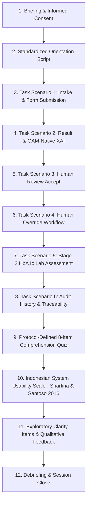

# Formal User-Study Evaluation Protocol (Phase E1)
## Stimulus Target: `research-prototype-v1.0`

**Protocol Document Identifier:** `E1-PROTOCOL-2026-V1.0.3`  
**Protocol Version:** `1.0.3` (Final Cross-Document Stimulus Reconciliation)  
**Date:** 2026-09-05  
**Governing Research Skills:** `research-governance` (preeminent), `dashboard-design`, `frontend-quality`  
**Prototype Release Baseline:** `research-prototype-v1.0` (144 automated tests passing, 4 protected artifact hashes verified)  
**Primary Study Language:** **Bahasa Indonesia** (Indonesian SUS adaptation: Sharfina & Santoso, 2016)  
**Canonical Stimulus Authority:** [`E1_STIMULUS_LOCK.md`](file:///c:/Users/Felix/Documents/Skripsi/evaluation/e1/E1_STIMULUS_LOCK.md)  

---

## 1. Executive Summary & Purpose

This document establishes the formal, frozen evaluation methodology for assessing the human usability, interaction comprehension, and decision-support workflow of **`research-prototype-v1.0`**.

The evaluation is designed as an undergraduate thesis research study. It adheres strictly to the **Evidence Layer Separation Principle**:
- **Predictive performance** of the machine learning model is frozen and derived exclusively from Phase 5 held-out test cohort analysis (NHANES 2021–August 2023).
- **Explainability (XAI) fidelity** is frozen and verified mathematically via Phase D2.5 reconstruction testing.
- **Software correctness and data isolation** are frozen and audited via Phase D2/D3 verification.
- **Usability and comprehension** are evaluated through this protocol via structured human evaluation using standardized synthetic scenarios.

```
+-----------------------------------------------------------------------------------+
|                        RESEARCH EVIDENCE LAYERS (STRICTLY SEPARATED)              |
+-----------------------------------------------------------------------------------+
| Layer A: Predictive Validation  --> Phase 5 Held-out NHANES Test (N=812, AUC 0.7277)|
| Layer B: XAI Fidelity           --> Phase D2.5 Exact Mathematical Reconstruction   |
| Layer C: System Correctness     --> Phase D2-D3 (144 Automated Tests, Zero Defects)|
| Layer D: Usability              --> Phase E1-E3 User Study (Indonesian SUS + Tasks)|
| Layer E: User Comprehension     --> Phase E1-E3 Protocol-Defined Comprehension Quiz |
| Layer F: Domain Face Validity   --> Optional 3-5 Health Professional Reviews       |
+-----------------------------------------------------------------------------------+
```

**CRITICAL METHODOLOGICAL BOUNDARY:**  
This evaluation **DOES NOT** constitute a randomized clinical trial, diagnostic accuracy study, clinical efficacy trial, or clinical safety validation. User evaluation data must never be conflated with model predictive performance or clinical effectiveness.

---

## 2. Research Questions (Reconciled & Locked)

| Research Question | Construct | Primary Evidence Source | Analysis Nature |
| :--- | :--- | :--- | :--- |
| **RQ1 (Predictive Performance)**<br>How well does the frozen non-laboratory GAM discriminate and calibrate HbA1c-defined dysglycemia in the held-out NHANES test cohort? | Discrimination & Calibration | Phase 5 held-out test dataset ($N = 812$, normal-range = 621, dysglycemia-range = 191, `nhanes_feasibility_2021_2023`) | Quantitative offline validation (ROC-AUC, PR-AUC, Sensitivity, Specificity, Brier score). **Requires no user-study data.** |
| **RQ2 (System Integration & Auditability)**<br>How can GAM-native explanation and Human Review / Human Override be integrated into an auditable two-stage screening dashboard while preserving the original AI output and decision provenance? | System Architecture, Auditability & Correctness | Phase D2.3–D2.8 contracts, Phase D3 final audit, 144 automated unit/integration tests | Functional verification & lifecycle scenario testing. **Requires no user-study data.** |
| **RQ3 (System Usability)**<br>How usable is the frozen two-stage screening dashboard for participants performing the defined screening-review tasks? | Usability, Operability & Learnability | Standard 10-item System Usability Scale (Indonesian adaptation: Sharfina & Santoso, 2016), task completion rates, task errors, assistance levels | Quantitative descriptive statistics (mean, SD, median, IQR) relative to published empirical reference distributions. |
| **RQ4 (User Comprehension)**<br>How well do participants understand the Stage-1 screening result, GAM-native explanation, Human Review / Override semantics, and Stage-2 laboratory-range output? | Conceptual Comprehension & Mental Model Fidelity | 8-item protocol-defined objective comprehension test, qualitative open feedback, custom clarity perception items | Quantitative item-level correctness + descriptive score distributions. |

---

## 3. Protocol Architecture & Participant Journey

The user-study session is structured as a single-session, standardized laboratory or controlled remote trial lasting approximately **30 to 45 minutes** per participant.



### Session Steps Breakdown:
1. **Briefing & Informed Consent (5 mins):** Explanation of voluntary participation, confidentiality, pseudonymous coding, and research prototype scope. Participant signs consent.
2. **Pre-Task Orientation (5 mins):** Neutral walkthrough of UI layout (sidebar, cards, tables). **STRICT RULE:** The moderator demonstrates layout elements but **NEVER** discloses the answers to comprehension questions or the rationale behind XAI factors.
3. **Interactive Synthetic Tasks (15–20 mins):** Execution of 6 standardized tasks (Tasks 1–6) using pre-packaged fictional screening profiles (Case Alpha and Case Beta). No real patient data are ever entered.
4. **Post-Task Evaluation Battery (10–15 mins):**
   - 8-item Protocol-Defined Objective Comprehension Assessment (closed-book, multiple-choice, mandatory responses).
   - Standard 10-item System Usability Scale (Indonesian adaptation: Sharfina & Santoso, 2016, mandatory responses).
   - 5 Custom Exploratory Clarity Items (5-point Likert, mandatory responses).
   - 3 Open-ended qualitative feedback questions (categorized via lightweight analysis informed by Braun & Clarke, 2006).
5. **Debriefing (2 mins):** Session conclusion, answering participant questions, thanking participant.

---

## 4. Participant Strategy & Sampling Plan

### 4.1 Primary Usability Group (Lay/General Users)
- **Target Sample Size:** $N = 24\text{ to }30$ completed sessions (Practical minimum: $N = 20$).
- **Target Population:** University undergraduate and postgraduate students, staff, and general adult computer users.
- **Sampling Strategy:** Non-probability convenience and purposive sampling.
- **Permitted Claims:** Interface usability, task completion, interaction friction, visual layout clarity, and conceptual comprehension of screening outputs.
- **Prohibited Claims:** Clinician acceptance, clinical workflow efficiency, diagnostic reliability, or appropriateness for real-world patient triage.

### 4.2 Optional Expert Review Group (Health Professionals)
- **Target Sample Size:** $N = 3\text{ to }5$ healthcare practitioners (physicians, nurses, or clinical trainees).
- **Sampling Strategy:** Purposive expert sampling.
- **Permitted Claims:** Face validity of terminology, perceived plausibility of the screening/referral workflow, qualitative feedback on decision-support fit.
- **Prohibited Claims:** Clinical trial evidence, improved diagnostic accuracy, proven reduction in medical errors.
- **Analytical Rule:** Expert responses **MUST NOT** be pooled with the primary group's SUS score; they must be reported in a separate qualitative/expert subsection.

---

## 5. Experimental Controls & Environmental Standards

1. **Frozen Software Baseline:**  
   Every session runs against `research-prototype-v1.0`. Zero code changes, zero model re-weighting, and zero threshold alterations are permitted during data collection.
2. **Database Zero-State Isolation:**  
   The study server runs against a freshly initialized `db_study.sqlite3` containing exactly **0** screening records, reviews, or assessments prior to session 1. No synthetic demo records from development are exposed.
3. **Fictional Synthetic Cases Only:**  
   Participants are provided fixed, paper or PDF profile cards with fictional screening data. Under no circumstances may participants enter their personal medical history, BMI, blood pressure, or HbA1c.
4. **Standardized Moderator Interaction:**  
   Moderators adhere strictly to the 4-level assistance hierarchy:
   - *Level 0:* Independent execution.
   - *Level 1:* General prompt ("Please continue using the information on screen").
   - *Level 2:* Directional hint ("Look at the actions in the review panel").
   - *Level 3:* Procedural demonstration (Counts as task failure or assisted completion).
5. **Hardware Standardization:**  
   Primary evaluation conducted on standard laptop/desktop computers (screen resolution $\ge 1280 \times 800$ px, modern Chromium or Gecko browser). Mobile layout is validated functionally but is not the primary desktop evaluation apparatus.

---

## 6. Document Governance & Release Control

- **Precedence:** In the event of any conflict between this protocol and informal task notes, this document shall govern.
- **Modifications Post-Lock:** Any modifications to tasks, comprehension items, or scoring after Protocol Version 1.0 lock require an entry in `E1_PROTOCOL_CHANGELOG.md` and explicit supervisor approval.
- **Pilot / Ethics Sequencing:** Protocol readiness does NOT authorize participant recruitment or contact. Pilot testing ($N=3\text{--}5$) and subsequent formal evaluation may commence only after necessary academic supervisor signoff and institutional ethics clearances have been satisfied.
