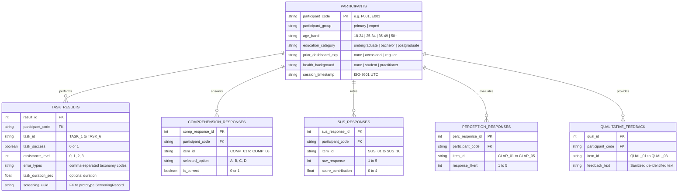

# Study Data Schema & Data Dictionary (Phase E1)
## Logical Dataset Architecture for User Evaluation

**Document Identifier:** `E1-DATA-SCHEMA-V1.0.3`  
**Protocol Version:** `1.0.3` (Final Cross-Document Stimulus Reconciliation)  
**Date:** 2026-09-05  
**Stimulus Target:** `research-prototype-v1.0`  

---

## 1. Schema Architecture Overview

The formal evaluation dataset is organized into six normalized relational structures (exported as clean, de-identified CSV files).  
These structures link deterministically to the prototype's SQLite database via the pseudonymous `participant_code` (which matches `HumanReview.reviewer_code`).

---

## 2. Table-by-Table Data Dictionary

### 2.1 Table: `participants.csv`
Contains demographic and categorical metadata. Completely de-identified.

| Column Name | Data Type | Permitted Values | Description |
| :--- | :--- | :--- | :--- |
| `participant_code` | VARCHAR(16) | `P001`–`P030`, `E001`–`E005` | Primary unique key identifying the subject. |
| `participant_group` | VARCHAR(16) | `primary`, `expert` | Evaluation layer indicator. |
| `age_band` | VARCHAR(16) | `18-24`, `25-34`, `35-49`, `50+` | Broad age category (exact DOB is never recorded). |
| `education_category` | VARCHAR(32) | `high_school`, `undergrad`, `bachelor`, `postgrad` | Highest education level completed or ongoing. |
| `prior_dashboard_exp`| VARCHAR(16) | `none`, `occasional`, `frequent` | Prior familiarity with data/analytics dashboards. |
| `health_background` | VARCHAR(16) | `none`, `student`, `practitioner` | Professional or educational clinical exposure. |
| `session_date` | DATE | `YYYY-MM-DD` | Date the session took place. |

### 2.2 Table: `task_results.csv`
Logs behavioral task performance captured during the session.

| Column Name | Data Type | Permitted Values | Description |
| :--- | :--- | :--- | :--- |
| `participant_code` | VARCHAR(16) | FK to `participants` | Participant identifier. |
| `task_id` | VARCHAR(16) | `TASK_1` through `TASK_6` | Standardized task identifier. |
| `task_success` | INTEGER | `0`, `1` | Strict binary success (1 = Success, 0 = Failure/Assisted). |
| `assistance_level` | INTEGER | `0`, `1`, `2`, `3` | Highest assistance administered (0=None, 3=Demonstration). |
| `error_types` | VARCHAR(64) | Text / comma-separated | Taxonomy codes: `NAV_ERR`, `INPUT_ERR`, `INTERP_ERR`, etc. |
| `task_duration_sec`| FLOAT | Positive float or `NULL` | Optional task execution duration in seconds. |
| `screening_uuid` | VARCHAR(36) | UUIDv4 string | Connects task directly to SQLite `ScreeningRecord.id`. |

### 2.3 Table: `comprehension_responses.csv`
Captures raw responses to the 8 objective multiple-choice items.

| Column Name | Data Type | Permitted Values | Description |
| :--- | :--- | :--- | :--- |
| `participant_code` | VARCHAR(16) | FK to `participants` | Participant identifier. |
| `item_id` | VARCHAR(16) | `COMP_01` through `COMP_08` | Comprehension item identifier. |
| `selected_option` | CHAR(1) | `A`, `B`, `C`, `D` | Option letter selected by the participant. |
| `is_correct` | INTEGER | `0`, `1` | Binary accuracy score based on keyed correct answer. |

### 2.4 Table: `sus_responses.csv`
Stores the raw, item-by-item Likert responses to the System Usability Scale.

| Column Name | Data Type | Permitted Values | Description |
| :--- | :--- | :--- | :--- |
| `participant_code` | VARCHAR(16) | FK to `participants` | Participant identifier. |
| `item_id` | VARCHAR(16) | `SUS_01` through `SUS_10` | SUS item identifier (odd=positive, even=negative). |
| `raw_response` | INTEGER | `1`, `2`, `3`, `4`, `5` | Raw Likert value (1=Strongly Disagree, 5=Strongly Agree). |
| `scored_value` | INTEGER | `0`, `1`, `2`, `3`, `4` | Recoded contribution value prior to $2.5\times$ scaling. |

### 2.5 Table: `perception_responses.csv`
Stores responses to custom exploratory Likert items.

| Column Name | Data Type | Permitted Values | Description |
| :--- | :--- | :--- | :--- |
| `participant_code` | VARCHAR(16) | FK to `participants` | Participant identifier. |
| `item_id` | VARCHAR(16) | `CLAR_01` through `CLAR_05` | Custom clarity item identifier. |
| `response_likert` | INTEGER | `1`, `2`, `3`, `4`, `5` | Likert rating (1=Strongly Disagree, 5=Strongly Agree). |

### 2.6 Table: `qualitative_feedback.csv`
Stores sanitized open-ended feedback.

| Column Name | Data Type | Permitted Values | Description |
| :--- | :--- | :--- | :--- |
| `participant_code` | VARCHAR(16) | FK to `participants` | Participant identifier. |
| `item_id` | VARCHAR(16) | `QUAL_01`, `QUAL_02`, `QUAL_03` | Open-ended question identifier. |
| `feedback_text` | TEXT | Free-text string | Sanitized participant remarks (free of names or PII). |

---

## 3. Linkage Integrity & Data Hygiene Verification

Before any dataset is accepted for analysis:
1. **Referential Integrity Check:** Every `participant_code` in tables 2.2–2.6 must exist in `participants.csv`.
2. **Item Count Audit:** Exactly 10 SUS records, 8 comprehension records, and 5 perception records must exist per completed participant.
3. **Audit Cross-Check:** For every participant who completed Task 3 or Task 4, a corresponding row must exist in the SQLite table `HumanReview` where `reviewer_code = participant_code`.
